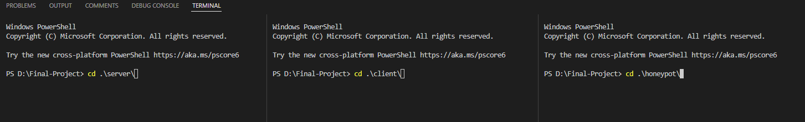

# Identifying Attackers On The Web:

## Project Background
> This is only a demo and doesn't represent the real purposed system.

The main purpose of the project is to provide the system administrator the tools needed to track suspicious activities of users on the web. Moreover, allow to identify and analyze the method of which the attacker attempted to exploit and create a vulnerability.
In order to consider a successful outcome of the project I've defined criteria's which the proposed system must meet, these criteria are based on the OWASP top 10 common types of cyber-attacks. It is defined that it will intercept and identify at least 60-80% of the attack and classify correctly.

The research that the system is based on:<br/>
[Final Project (pdf)]([https://drive.google.com/file/d/179S89UskXJf8TSdbnJFdZBHrUWe-J5HL/view?usp=sharing](https://drive.google.com/file/d/1KPQNvCrHI14eeCWxI-_PPPNt2wdZagF9/view?usp=sharing)

# How To Run Locally:
Clone the repo from `https://github.com/DanielAizen/Identifying-attacker-on-the-web.git`
Open 3 terminals as shown here:

<br/>
Then inside each terminal run the following commands
* Server: Choose between two scripts - 
  * allows to run a live server that updates on change ``` npm run dev ```
  * allows to run live server ``` npm start ```
* Client:
  * ```npm start ```
* Honeypot:
  *  ```node honeypot.js ```

The website will be available at [`http://localhost:5002`](http://localhost:5002)

# Datbases table creation:

## Request:
```SQL
CREATE TABLE `request` (
  `id` int(11) NOT NULL AUTO_INCREMENT,
  `date` datetime(6) NOT NULL DEFAULT CURRENT_TIMESTAMP(6),
  `ip` varchar(128) DEFAULT NULL,
  `service` varchar(16) DEFAULT NULL,
  `request` varchar(4096) DEFAULT NULL,
  `request_headers` mediumtext,
  `http_request_path` varchar(1024) DEFAULT NULL,
  `username` varchar(128) DEFAULT NULL,
  `password` varchar(128) DEFAULT NULL,
  PRIMARY KEY (`id`)
);
```
## User info:
```SQL
CREATE TABLE `user_info`
(
	  `uid` int not null auto_increment unique,
    `first_name` varchar(255),
    `last_name` varchar(255),
    `email` varchar(255),
    `password` varchar(80),
    `role` varchar(20),
    `date_joined` datetime,
    PRIMARY KEY (`uid`)
);
```
## Honeypot logs
```SQL
CREATE TABLE `honeypot_logs` (
	  `lid` int not null auto_increment,
    `timestamp` datetime(6) NOT NULL DEFAULT CURRENT_TIMESTAMP(6),
    `request_body` varchar(1024) default null,
    `path` varchar(20) default null,
    PRIMARY KEY (`lid`)
);
 ```


# !! IMPORTANT !!
PLEASE NOTE!:  This site is used for learning porpusus only 

## Meta
Aizenband Daniel - aiz.dani@gmail.com\
Distributed under MIT License. See LICENSE for more information.
